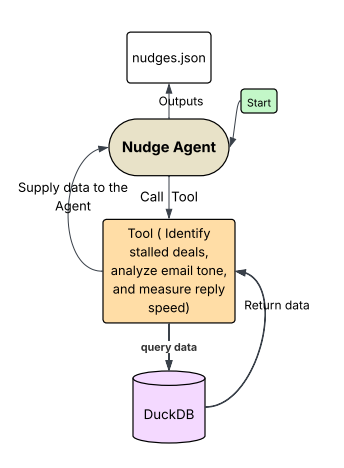

# Mini-Nudge Agent 🧠

This project builds an intelligent Mini-Nudge Agent leveraging OpenAI, LangChain, and DuckDB to automatically analyze CRM data and customer emails, then generate personalized follow-up suggestions ("nudges") for high-urgency deals.


## Overview 

- **Database:** Uses DuckDB, a powerful analytical database capable of efficiently handling both CSV and JSON data formats simultaneously. This enables smooth querying and data integration without complex ETL pipelines.
- **Agent:** Implements a React agent via LangGraph that can both reason and act, making it ideal for processing dynamic business data and providing actionable insights.
- **Goal:** Automate the detection of urgent deals and generate tailored nudges to improve sales follow-up effectiveness.
## General Architecture
# General Architecture

## Setup

1. Clone the repository.
2. Create a `.env` file in the project root directory with your OpenAI API key:
 ```bash
 OPENAI_API_KEY=your_openai_api_key_here 
 ```
 
3. Run the project with:
  ``` bash
  uvx --from "." --with-editable "." -- python main.py
  ```
**What is uvx?** 🧠
uvx is a command-line tool designed to run Python packages and scripts within isolated, reproducible environments .


This Mini-Nudge Agent is a prototype. It has the potential to become more intelligent and incorporate additional advanced features, laying the foundation for a powerful and scalable sales assistant.